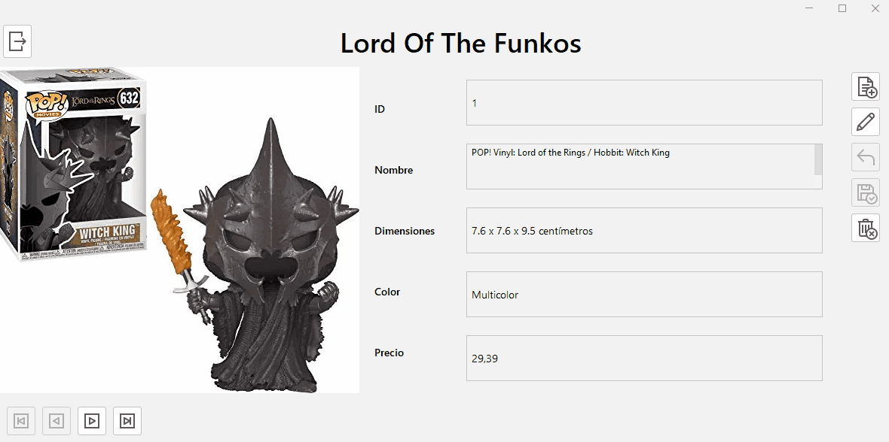
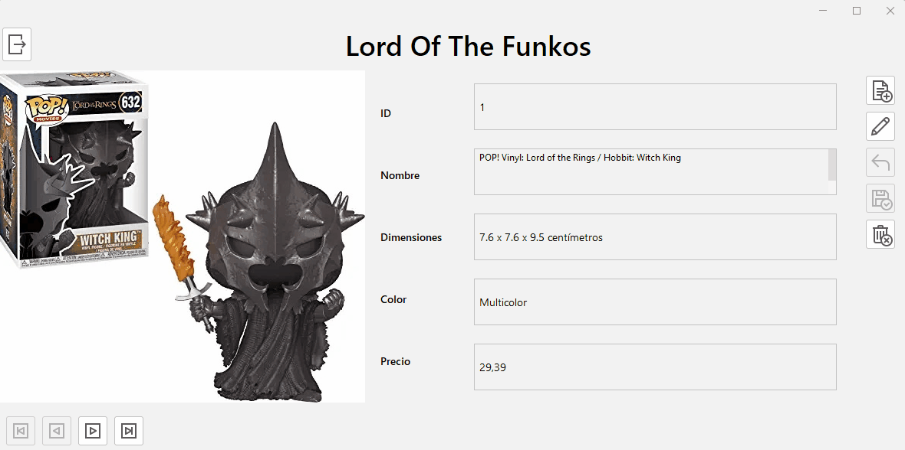
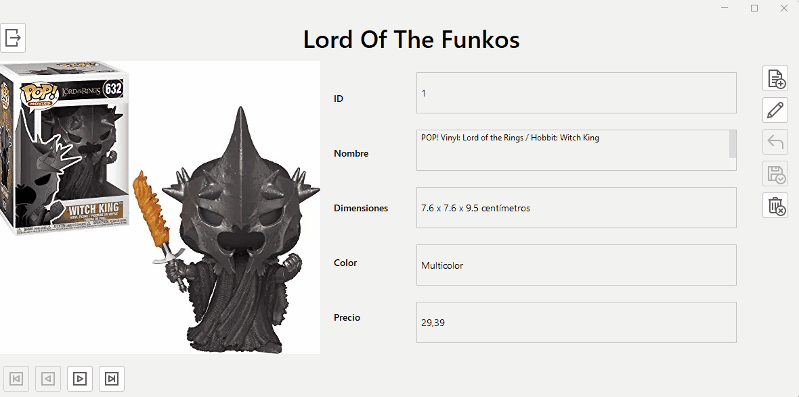

# Instrucciones

Añadir a la aplicación la siguiente funcionalidad

## Cambio de Estado

Los botones `nuevo`, `modificar` y `cancelar` **cambiarán el `estado` de la aplicación**. En el caso del botón `nuevo` se pondrá como `estado` `ALTA` y se llamará a `mostrar()`. De manera similar, el botón `modificar` pondrá `MODIFICACION` como `estado` y llamará a `mostrar()`. Por su parte. el botón `cancelar`, pondrá `CONSULTA` como estado y llamará también a `mostrar()`.

 

## Guardar

Al pulsar el botón guardar se realizarán las siguientes tareas:

- Se **creará un nuevo producto**

- Si el `estado` es `MODIFICACION` se le asignará como `id` el contenido del **control ID del formulario**

- Se **asignarán a los campos del producto** los **valores de los controles** correspondientes del formulario (menos el campo `foto` al que se asignará el valor de la propiedad `name` de la etiqueta)

- Si estamos en `estado` `ALTA`:
  
  - Llamaremos al método `nuevoFunko` del **servicio **con el **producto **que hemos modificado
  
  - Pondremos a `pos` el valor de la **última posición** de la lista
  
  - Pasaremos a `estado` `CONSULTA`
  
  - Llamaremos a `mostrar()`

- Si no
  
  - Llamaremos al método `modificarFunko` del **servicio** con el producto que hemos modificado
  - Pasaremos a `estado` `CONSULTA`
  - Llamaremos a `mostrar()`

 
El resultado hasta el momento:

</a>

### Adicional

Añadir **validación** para que no se puedan añadir productos a los que les falten datos
 

## Borrar

Al pulsar el botón `borrar`, se realizarán las siguientes tareas:
 

- Se **pedirá confirmación** para eliminar el producto

- Si se da
  
  - Se obtendrá el `id` del producto del `control ID` y se llamará al método `eliminarFunko` del servicio con dicho `id`
  
  - **Si tras borrar** la posición `pos` coincide con el **tamaño actual** de la lista quiere decir que **acabamos de eliminar el último producto**. En este caso, **restaremos uno a `pos`**
  
  - Llamaremos a `mostrar()`
    
    

Tras estos cambios :

</a>

### AVANZADO

#### Modificar la Foto

Queremos que **el usuario pueda cambiar la foto de un producto** (sólo en estado `ALTA` o `MODIFICACION`). Para ello vamos a hacer que, **cuando se haga clic en la imagen** es estos estados:

- Se muestre un cuadro de diálogo para que el usuario seleccione la nueva foto (premio si sólo se permite seleccionar imágenes JPG o PNG). Por simplicidad vamos a  situar previamente las nuevas fotos en la carpeta `imágenes`

- Al **seleccionar la foto**, se **asigne como imágen a la etiqueta** y se **ponga su nombre** en la propiedad `name`

- Conseguir que **aparezca el cursor con la mano cuando se puede modificar**.

 
El resultado:

</a>

 

#### Problema si se borran todos los productos

Tal y como está la aplicación, no funciona bien si se borran todos los productos. Descubrir por qué y solucionarlo.
 

# Guardar los Cambios

Una vez hachas todas las pruebas, reactivar en el DAO la opción para guardar los cambios en el fichero. 
 
Comprobar que los cambios en los productos son, ahora, permanentes
 

